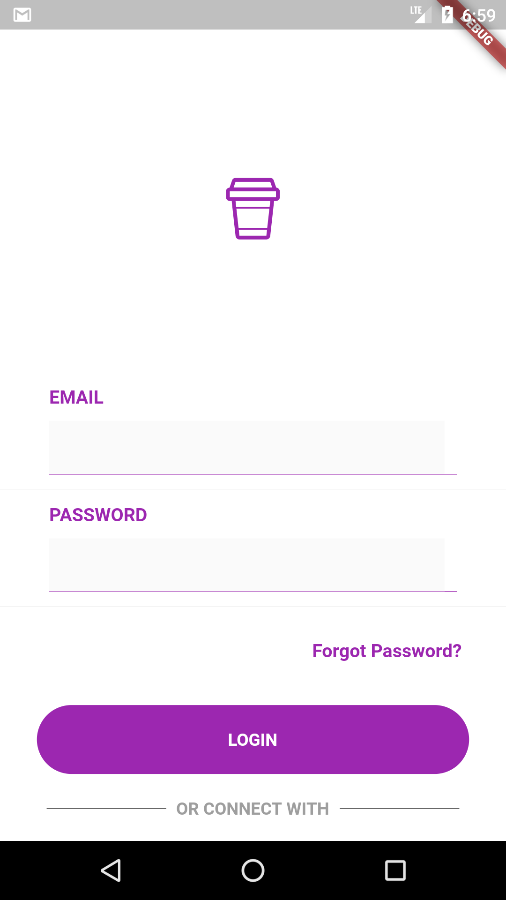
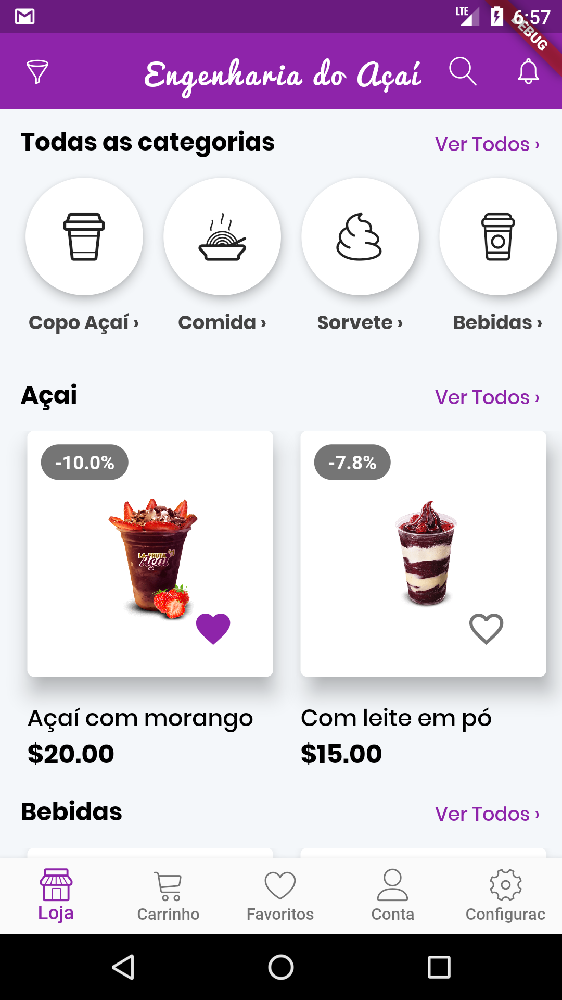
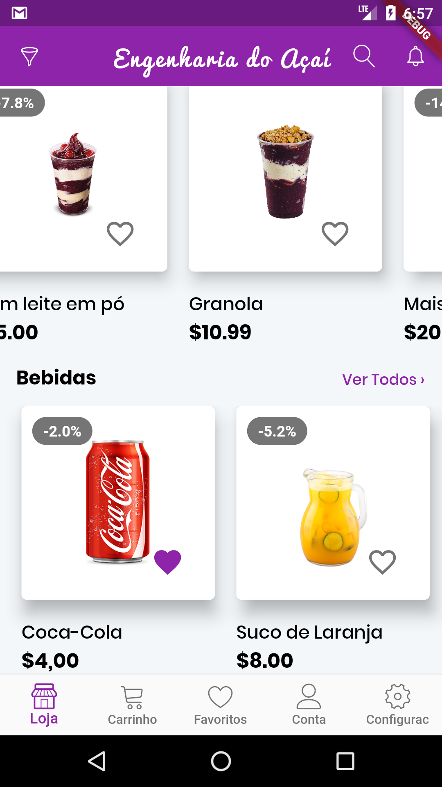
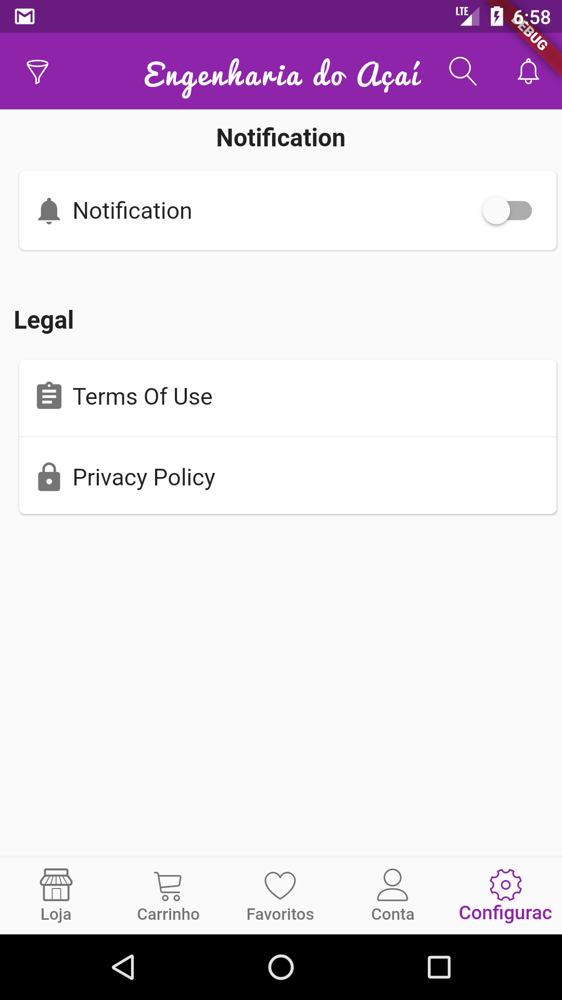
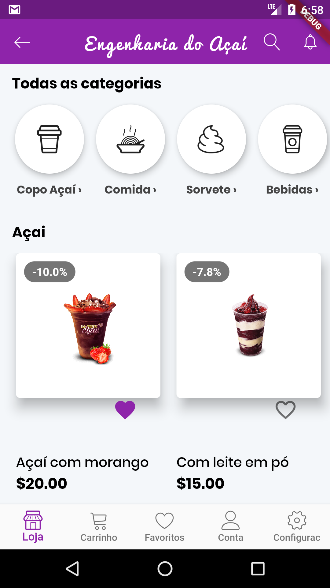

A Flutter UI template 
based on https://github.com/ahkohd/FlutterGrocery-ShoppingAppUI project

Design screens are on [Uplabs.](https://www.uplabs.com/posts/grocery-shopping-full-app) It's premium, purchase it if you want to use it commercially.

The screenshots below are taken on a android emulator.

| 1 | 2|
|------|-------|
|||

| 3 | 4|
|------|-------|
|||

| 5 | 6|
|------|-------|
|||

- Any Operating System (ie. MacOS X, Linux, Windows)
- Any IDE with Flutter SDK installed (ie. IntelliJ, Android Studio, VSCode etc)
- A little knowledge of Dart and Flutter
- Some fingers to code 
 
